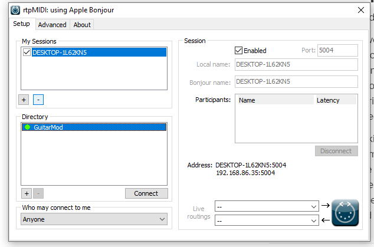

# Wireless Midi Guitar Knob 

This project describes how to build a Wireless MIDI guitar knob that will send
MIDI signals via WIFI to your PC or Mac.

## Requirements

- ESP32 S2 Microcontroller (Tested with a Lolin S2 Mini)
- Potentometer (Tested with a 250k Audio Taper tone pot)
- Portable rechargable battery pack with USB connection
- Soldering iron, solder, connection wire (I use the same vintage push back
  wiring as all my normal guitar electronic)
- [Platform IO](https://platformio.org/)
- PC users will also need to install [RTP
  MIDI](https://www.tobias-erichsen.de/software/rtpmidi.html) which enables your
  DAW to recognize your microcontroller as MIDI device. MAC OS has this built in. 

## The Build  

Its a 3-solder job. You'll need to solder the left pot pin to ground (labeled
GND on the board), center pin to GPIO 3, and right pin to 3.3V. That's it! 

Install it in your guitar like a normal pot. You'll need to connect a
rechargeable battery pack to the controller via USB C for power. Do that however you see fit. 

## The Code 

Built using Platform IO through VS Code. The source code should work through
Arduino IDE provided you install the correct dependencies. 

### Uploading to your board

Plug your board into your computer via USB. Ensure that the correct board is
detected by PlatformIO before continuing. If you are using a different board, make sure you have updated the
`platform.ini`
file accordingly. You'll also need you change the `upload_port` to match
whatever port your computer has assigned. You can run the `devices` command in
PlatformIO via VS Code to print the available ports. 

## Provisioning WiFI

Once your board is powered on it will go into Access Point mode
and become available as a WiFi Access Point. Connect to the access point using
any device with a browser (your phone, probably). Upon connecting you'll get a
popup window that will let you select an existing WiFi network and enter a
password. Upon connecting to the network the board will turn back into station
mode. You can now connect it to your DAW (see below).

Refer to the [WiFiManager Docs](https://github.com/tzapu/WiFiManager) for more
details if needed.

## Connecting To Your DAW

MAC OS users have RTP MIDI installed already. Follow [these
instructions](https://support.apple.com/guide/audio-midi-setup/share-midi-information-over-a-network-ams1012/mac)
to create an RTP MIDI session.

PC Users will need to install RTP MIDI first as it isn't included in the OS.
Once installed, when you open it up you will need to create a session.

When the microcontroller is connected to the network, you should see `GuitarMod`
available in the directory.

Click "Connect", and wait a few moments for it to connect. Once connected, you
should see a latency measurement in miliseconds. 

 

 Once you get a latency measurement, you can open your DAW and you should
 see a new MIDI device available with a name that matches your RTP session. 

 Congrats! You can now map that controller to parameters in your DAW and control
 them from your guitar!
